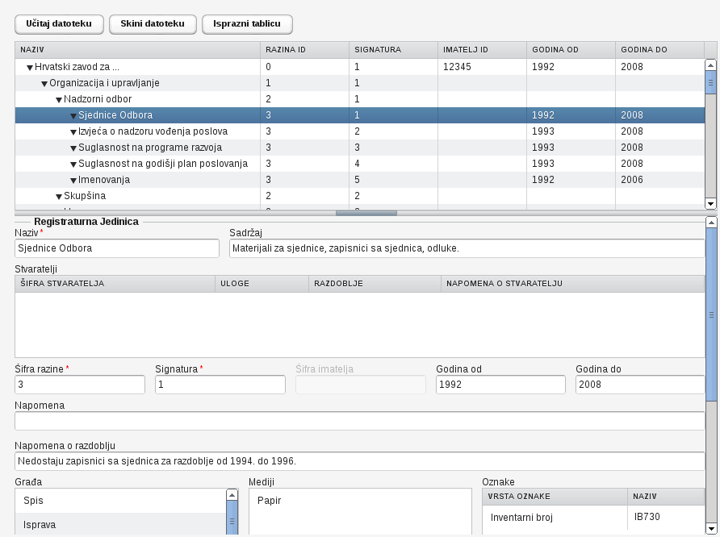

## Što je ArhiXML

ArhiXML je aplikacija pomoću koje se izrađuju popisi arhivskog gradiva koje tvrtke i institucije posjeduju u svojim pismohranama, a dužne su taj popis elektronski dostavljati državnom arhivu (ARHiNET).

ARHiNET je mrežni informacijski sustav za opis, obradu i upravljanje arhivskim gradivom.

## Zašto baš ta ideja za projekt?

Inicijator ideje je Elizabet Nemet koja je ujedno i član Open Source Osijek.

Prema Pravilniku o izmjenama i dopunama Pravilnika o zaštiti i čuvanju arhivskog i registraturnog gradiva izvan arhiva (`NN 106/07`) tvrtke su dužne popis arhivskog gradiva dostavljati u elektronskom obliku.

Tvrtke imaju dva izbora; koristiti sam ARHiNET sustav koji se naplaćuje ili besplatno sami izraditi XML datoteku te istu slati ARHiNET sustavu.

- ARHiNET nudi dokumentaciju i pravila po kojima se izrađuje XML datoteka.
- Sama izrada XML datoteke nije jednostavna te traži određeni nivo tehničkog predznanja.
- Nakon izrade XML datoteke, ista se mora validirati. Postoje alati koji validiraju XML datoteku pomoću XML schema datoteke.
- Takvi alati predstavljaju dodatnu investiciju za korisnika te također traže određeni nivo tehničkog predznanja za ispravno korištenje.

Elizabet, za potrebe obavljanja svog posla, došla je na ideju da se napravi računalna aplikacija koja će olakšati unos arhive u digitalni oblik. Naravno, bez korištenja i plaćanja ARHiNET sustava. Ona je proučila sva pravila koje nameće ARHiNET te sastavila dokument sa svim zahtjevima i napisala XML datoteku. Zajedno smo implementirali prvu verziju aplikacije i dali je na korištenje. Rezultat naše suradnje je ArhiXML. ArhiXML je olakšao pravljenje XML datoteke koji se kopira na CD i šalje u arhiv. S tim su se postigle velike uštede za firme koje su obavezne popisivati arhivske građe i dostavljati popis u elektronskom obliku.

## Po čemu je ova aplikacija zanimljiva?

1. Kod razvoja ove aplikacije želja nam je bila prezentirati tehnike i tehnologije koje se temelje na *server-side* programiranju s mogućnošću definiranja dijela aplikacije koji će se izvršavati na poslužitelju i na klijentskoj strani (web preglednik). Također, aplikacija mora biti razvijana na način da omogućava maksimalnu brzinu rada i pouzdanost.
2. Potom smo željeli da se samo vrijeme razvoja aplikacije skrati i pojednostavi što je moguće više te da se u razvoju ne treba brinuti u tome kako će se sama Web stranica iscrtavati (renderirati) i sl..
3. Nadalje, željeli smo izraditi funkcionalnu aplikaciju neovisnu o operativnom sustavu na kojemu će se izvršavati i poslužiteljska i klijentska strana, te da na klijentskoj strani ne smije biti potrebe za instaliranjem bilo kakvog dodatnog softvera.
4. Osim toga, naš zahtjev u razvoju aplikacije je bio i taj da se aplikacija mora moći izvršavati unutar minimalnog cluster sustava, otpornog na ispade.
5. Slijedeći zahtjev je bio da se sama aplikacija može vrlo brzo i jednostavno nadograditi, i to samo na strani poslužitelja u nekoliko sekundi (ne računajući vrijeme kopiranja datoteke na poslužitelj) te da se instalacija može automatski proširiti na sve poslužitelje u clusteru.
6. Na kraju želimo da se ova aplikacija može uz minimalne prepravke instalirati na našu buduću [Cloud Web portal platformu][1].
7. Ove tehnike će kasnije biti korisne za većinu projekata koje pokrećemo kao i za bilo koje druge naprednije projekte.

## Kako to radi?

- Aplikacija je pisana u programskom jeziku Java koristeći Vaadin *framework*. Za razliku od drugih *server-side* aplikacija, aplikacije koje su pisane u programskom jeziku Java omogućavaju brže izvršavanje, bolju kontrolu te manje trošenje resursa (ovo zadovoljava zahtjeve 1, 2 i 3). Ne zaboravimo i činjenicu da je Java platforma provjerena u desetljetnom radu u najzahtjevnijim okruženjima (telekomi, industrija). Osim toga korištenjem Vaadin frameworka smo ubrzali vrijeme razvoja aplikacije jer nam sam framework nudi obilje funkcionalnosti o kojima se više ne moramo brinuti, već ih samo treba koristiti. Vaadin je također dokazan u radu, dugi niz godina.
- Pošto je aplikacija pisana u Java programskom jeziku, za njeno izvršavanje je potreban minimalno samo *Servlet Container*, ali pošto smo imali zahjev za radom u clusteru (točka 4), minimalno preporučamo Apache Tomcat ili neki od *Java Application* servera koji također imaju mogućnost rada u Clusteru kao što su GlassFish, JBoss, WebSphere i ostali.
- Nadalje, zahtjev za brzom i automatskom nadogradnjom aplikacije (točka 5) riješen je u svim *Servlet Container* kao i u *Java Application* serverima.

## Korištene tehnologije

- Mozilla Firefox i Google Chrome.
- Java.
- Vaadin.
- Eclipse.
- Apache Tomcat.

## Korisničko sučelje

Sučelje je konceptualno podijeljeno na dva dijela; glavna tablica i forma.

Glavna tablica sadrži hijerarhijski popis svih registraturnih jedinica. Forma sadrži detaljne podatke o jednoj registraturnoj jedinici.

## Primjer XML datoteke


<?xml version="1.0" standalone="yes"?>
<ARHiNET xmlns="http://arhinet.arhiv.hr/ARHiNET.xsd">
<RegistraturnaJedinica ImateljId="12345" RazinaId="0" Signatura="1" Naziv="Hrvatski zavod za ..." GodinaOd="1992" GodinaDo="2008">
    <Stvaratelj StvarateljId="98765" UlogaId="1"/>
    <RegistraturnaJedinica RazinaId="1" Signatura="1" Naziv="Organizacija i upravljanje">
        <RegistraturnaJedinica RazinaId="2" Signatura="1" Naziv="Nadzorni odbor">
            <RegistraturnaJedinica RazinaId="3" Signatura="1" Naziv="Sjednice Odbora" GodinaOd="1992" GodinaDo="2008">
                <NapomenaORazdoblju>Nedostaju zapisnici sa sjednica za razdoblje od 1994. do 1996.</NapomenaORazdoblju>
                <Sadrzaj>Materijali za sjednice, zapisnici sa sjednica, odluke.</Sadrzaj>
                <Gradja KomPodvrstaId="1"/>
                <Medij VrstaMedijaId="1"/>
                <KolicinaArhivskihJedinica MjernaJedinicaId="1" Kolicina="1"/>
                <KolicinaTehnickihJedinica VrstaTehnickeJediniceId="91" Kolicina="14"/>
                <KolicinaTehnickihJedinica VrstaTehnickeJediniceId="23" Kolicina="1"/>
            </RegistraturnaJedinica>
            <RegistraturnaJedinica RazinaId="3" Signatura="2" Naziv="Izvješća o nadzoru vođenja poslova" GodinaOd="1993" GodinaDo="2008">
                <Gradja KomPodvrstaId="1"/>
                <Medij VrstaMedijaId="1"/>
                <KolicinaArhivskihJedinica MjernaJedinicaId="1" Kolicina="0.3"/>
                <KolicinaTehnickihJedinica VrstaTehnickeJediniceId="91" Kolicina="4"/>
            </RegistraturnaJedinica>
            <RegistraturnaJedinica RazinaId="3" Signatura="3" Naziv="Suglasnost na programe razvoja" GodinaOd="1993" GodinaDo="2008">
                <Gradja KomPodvrstaId="1"/>
                <Medij VrstaMedijaId="1"/>
                <KolicinaArhivskihJedinica MjernaJedinicaId="1" Kolicina="0.1"/>
                <KolicinaTehnickihJedinica VrstaTehnickeJediniceId="91" Kolicina="1"/>
            </RegistraturnaJedinica>
            <RegistraturnaJedinica RazinaId="3" Signatura="4" Naziv="Suglasnost na godišnji plan poslovanja" GodinaOd="1993" GodinaDo="2008">
                <Gradja KomPodvrstaId="1"/>
                <Medij VrstaMedijaId="1"/>
                <KolicinaArhivskihJedinica MjernaJedinicaId="1" Kolicina="0.1"/>
                <KolicinaTehnickihJedinica VrstaTehnickeJediniceId="91" Kolicina="1"/>
            </RegistraturnaJedinica>
            <RegistraturnaJedinica RazinaId="3" Signatura="5" Naziv="Imenovanja" GodinaOd="1992" GodinaDo="2006">
                <Gradja KomPodvrstaId="1"/>
                <Medij VrstaMedijaId="1"/>
                <KolicinaTehnickihJedinica VrstaTehnickeJediniceId="23" Kolicina="1"/>
            </RegistraturnaJedinica>
        </RegistraturnaJedinica>
        <RegistraturnaJedinica RazinaId="2" Signatura="2" Naziv="Skupština"/>
        <RegistraturnaJedinica RazinaId="2" Signatura="3" Naziv="Uprava"/>
        <RegistraturnaJedinica RazinaId="2" Signatura="4" Naziv="Normativni akti"/>
    </RegistraturnaJedinica>
    <RegistraturnaJedinica RazinaId="1" Signatura="2" Naziv="Opći poslovi"/>
    <RegistraturnaJedinica RazinaId="1" Signatura="3" Naziv="Pravni poslovi"/>
    <RegistraturnaJedinica RazinaId="1" Signatura="4" Naziv="Financijsko i računovodstveno poslovanje"/>
    <RegistraturnaJedinica RazinaId="1" Signatura="5" Naziv="Ljudski potencijali"/>
    <RegistraturnaJedinica RazinaId="1" Signatura="6" Naziv="Stručna djelatnost zavoda"/>
</RegistraturnaJedinica>
</ARHiNET>


## Tehnički zahtjevi

- Zahtjevi su definirani od strane ARHiNET sustava u obliku dokumentacije i XML schema datoteke.
- Korisniku aplikacije maksimalno sakriti kompleksnost same XML datoteke.
- Ulaz u aplikaciju i izlaz iz aplikacije je XML datoteka koja mora biti pravovaljanja, tj. po pravilima ARHiNET sustava.

## Status projekta

Softver je funkcionalan. Podržava sva pravila koja su opisana na stranicama ARHiNET-a.
Postoje mogućnosti napretka kao što je povećati performanse, poboljšati korisničko sučelje te ispraviti uočene sitne nedostatke.

Dodatne informacije kao i sam izvorni kod softvera možete pronaći na https://github.com/hvarga/arhixml.

## Isprobajte aplikaciju

ArhiXML je dostupan isključivo putem *self-hosting* načina. Dakle, korisnik je odgovoran za instalaciju i održavanje vlastite instance. Da bi olakšali, pripremili smo i Docker image koji se može koristiti za lakšu instalaciju. Više o tome na https://github.com/hvarga/arhixml.

[1]: https://www.opensource-osijek.org/wordpress/razvoj-cloud-web-portal-platforme-synergy/ "Razvoj cloud web portal platforme Synergy"