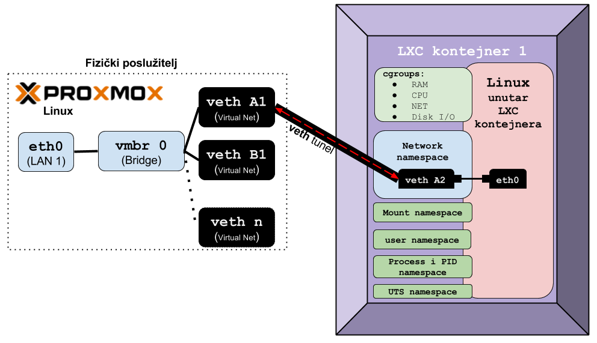

Duže vrijeme nismo spominjali Proxmox VE platformu za virtualizaciju i Linux kontejnere, zapravo od [zadnjeg predavanja]() o **Proxmox VE** platformi iz 6. mjeseca prošle godine.

Pošto je naš tehnološki partner [Proxmox Server Solutions GmbH](https://www.proxmox.com) od tada napravio mnoge promjene, vrijeme je, a jednim dijelom i naša obaveza, kako bi vas upoznali s novostima.

Za one od vas koji su ostali na verziji 3.x, preporuka je prelazak na novu generaciju 4.x. Namjerno ne govorim o verziji 4.x. jer se radi o prelasku na potpuno novu platformu. I dalje je hipervizor za virtualke Linux QEMU/KVM ali se s **OpenVZ** Linux kontejnera prešlo na **LXC** Linux kontejnere. Sve ostale sličnosti su u novoj generaciji sve manje.

Naime stara generacija 3.x. je nasljeđivala razne tehnologije još od prije, a s novom generacijom 4.x. prešlo se na nove tehnologije ili na novije verzije starih tehnologija, a koje u pravilu više nisu unatrag kompatibilne. Jedna od tih tehnologija je poznati [corosync klaster](http://corosync.github.io/corosync/) koji se unutar Proxmox VE platforme koristi za dodavanje Proxmox VE poslužitelja u Proxmox klaster, te za sve poslove koji su vezani uz klasterski rad. Sve ovo ne bi bilo moguće bez dodatno razvijenog tzv. [**Proxmox Cluster File System**](https://pve.proxmox.com/wiki/Proxmox_Cluster_File_System_(pmxcfs)).

Ovaj transakcijski klasterski datotečni sustav donosi slijedeće mogućnosti (uz dodatne funkcionalnosti koje ubjedinjuje Proxmox klaster):

* stabilnan je (u produkcijskoj je upotrebi cijeli niz godina),
* pouzdan je i otporan na ispade bilo kojeg poslužitelja (ili više njih – ovisno o njihovom broju),
* distribuiran – svi poslužitelji imaju pristup svim konfiguracijskim datotekama u svakom trenutku
* repliciranje promjena između poslužitelja u klasteru se izvodi transakcijski (pouzdano)
* sve promjene na bilo kojoj konfiguracijskoj datoteci su vidljive svim Proxmox VE poslužiteljima u klasteru, trenutno – čim se promjena dogodila

Vezano za sam rad klastera i njegove mogućnosti, sada novi Proxmox VE 4.x. ima novi klaster, koji podržava rad do 32 fizička poslužitelja u klasteru, a i sam klaster radi puno jednostavnije i brže. Sve to zahvaljujući prelasku na novu **_corosync_** generaciju (koji je naravno nekompatibilan sa starom generacijom).

Prelaskom na novi klaster poboljšana je i HA ([High Availability](https://pve.proxmox.com/wiki/High_Availability_Cluster)) funkcionalnost za virtualna računala i/ili linux kontejnere. Dakle sposobnost Proxmox VE klastera koja u slučajevima kada imamo vrlo važne virtualke ili linux kontejnere (one koje označimo kao **HA**) a koji stalno moraju biti pokrenuti, da se sustav brine o njihovom &#8220;zdravlju&#8221;. Naime za takve virtualke ili linux kontejnere, u slučaju kvara ili gašenja fizičkog Proxmox VE poslužitelja, **HA** komponenta sustava ih automatski pokreće na drugom dostupnom (živom) fizičkom poslužitelju.

Kao što sam spomenuo, vezano za Linux kontejnere, prešlo se sa OpenVZ Linux kontejnera na LXC Linux kontejnere.

## Zbog čega prelazak s OpenVZ na LXC kontejnere ##

OpenVZ linux kontejneri su stara i pouzdana te u produkciji provjerena tehnologija linux kontejnera koja se koristi desetak godina.

Ali?!

[OpenVZ linux kontejneri](https://openvz.org) su zahtijevali modifikaciju samog linux kernela te su bile potrebne i neke druge (doduše sitne) promjene i komponente. Pošto je Proxmox VE baziran na **Debian Linux** distribuciji, to je značilo kako se kod svake nove nadogradnje koja je došla od strane Debian Linuxa, prvo morao _rekompajlirati kernel_ te su se morale napraviti dodatne promjene. Osim toga ova tehnologija je zaslužila umirovljenje, barem prema odluci razvojnog tima Proxmox VE ali i mnogih ljudi koji su open source (volonteri) programeri za Proxmox VE ili su aktivni u Proxmox VE zajednici.

Odluka je bila očita: [LXC linux](https://linuxcontainers.org/lxc/introduction/) kontejnerska tehnologija koja je postala integrirana u novije linux kernele. Dakle sve što je bilo potrebno od strane kernela, sada se već nalazilo u njemu. Prošlo je neko vrijeme i određene stvari su se ispeglale u linux kernelu a vezane za LXC. Naravno prve verzije Proxmox VE 4.x nisu imale sve funkcionalnosti LXC linux kontejnera, kao što su imale za OpenVZ linux konetjnere ali to je bila stvar razvoja samih LXC kontejnera i podrške unutar Linux kernela. Velika prednost odnosno jednostavnost LXC kontejnera je upotreba tzv. [Linux kernel namespaces](https://en.wikipedia.org/wiki/Linux_namespaces) tehnologija (naravno unutar samog linux kernela).

Ovdje se radi o tehnologijama za izolaciju:

1. procesa i njihovih mehanizama komunikacije (IPC - _Interprocess Communication_)
2. PID (Process ID) - (_PID namespace_) - izolacija PID-ova pokrenutih procesa
3. mreže i mrežnih sustava (koji se oslanjaju na tzv. _network namespace_)
4. korisnika i njihovog rada (_user namespace_)
5. kontrolnih grupa (_cgroups_) - za izolaciju pripadnosti kontrolnih grupa pokrenutih procesa (kontrolne grupe su zadužene za dodjeljivanje, ograničavanje i izolaciju resursa: CPU, RAM, disk I/O, mreža...)
6. _mount namespace_ - zaduženih za mountanje unutar izoliranog prostora (LXC kontejnera konkretno)
7. _UTS namespace_ - omogućava promjene _hostname i domainname unutar_ izolacije za različite procese

Pogled na LXC kontejner iz perspektive Linuxa iz kojeg je pokrenut (Proxmox VE):


Pregled ostalih osnovnih tehnologija, koje su podržane već dugo vremena u Proxmox VE platformi:

* Linux Bonding (Agregacija/Teaming) i VLANovi - od 07.2008.g (Proxmox VE v0.9)
* live migracija KVM (Virtualke) i  OpenVZ (linux kontejneri) - od 10.2008.g. (Proxmox VE v1). Slika migracija virtualke (ID: 103) s jednog (fizičkog) Proxmox VE poslužitelja na drugi:

    

* podrška za VIRTIO uz dodanu podršku za [virtio_blk](https://www.linux-kvm.org/images/f/f9/2012-forum-virtio-blk-performance-improvement.pdf) (_para-virtualized block devices_) - od 05.2009 (Proxmox VE v.1.2)
* novi storage model, koji podržava razne vanjske i interne storage - od 09.2009 (Proxmox VE v1.4. beta 1):
  * iSCSI
  * NFS
  * LVM
  * DRBD
* mogućnost dodjeljivanje CPU Socketa ili jezgri (postao je svjestan [NUMA arhitekture](https://www.opensource-osijek.org/dokuwiki/wiki:knjige:uvod_u_linux#numa) za virtualke - od 09.2009 (Proxmox VE v1.4. beta 2)
* Uvodi se [SCST](https://en.wikipedia.org/wiki/SCST) podrška (na razini kernela i softvera), a koja daje brži rad te podržava više protokola: iSCSI, FC. Dodatno uvodi podršku za više storage interface-a prema virtualkama (SCSI pass-through, [block](https://en.wikipedia.org/wiki/Block_%28data_storage%29) I/O i file I/O) - od 10.2009.g (Proxmox VE v1.4)
* prelazak na [qemu-kvm](http://www.linux-kvm.org/page/FAQ#Preparing_to_use_KVM) (KVM) za virtualizaciju (brži i optimiziraniji od QEMU) - od 01.2010.g. (Proxmox VE v1.5) - u novije vrijeme su oba projekta spojena u jedan - [**QEMU**](http://www.qemu.org/)
* osim linux bond (agregacija/team), bridge i VLAN podrške (od 2008.g.) dodana je podrška za Open vSwitch, koji je znatno napredniji i prilagođen virtualizaciji. Preko njega  su podržane iste tehnologije (bond, bridge, i VLANovi) ali i mnoge druge napredne mogućnosti - od 03.2014.g. (Proxmox VE v3.2)
* ... i tako dalje

Za više detalja o osnovnim i naprednijim stvarima koje nudi Proxmox VE platforma, pogledajte članak od [prije]().

## Što je još zanimljivo kod Proxmox VE platforme ##

Za većinu funkcionalnosti nije otkrivana "topla voda" već su odabrane provjerene i dokazane tehnologije i rješenja iz _open source_ svijeta. Veliki naglasak je uvijek bio i biti će na optimalnoj upotrebi tih tehnologija, bez puno kompliciranja. Štoviše, cilj je svaku potrebnu tehnologiju iskoristiti na najbolji mogući inženjerski način, uz što manje komponenti, što jednostavniji dizajn i što bolje performanse.

Ako samo pogledamo mrežni model - dizajn je jednostavan, pouzdan, brz i bez puno komplikacija i filozofija. Bez obzira koristi li se Linux model: bond, bridge, VLAN ili open vSwitch model s istim komponentama. Način funkcioniranja je nevjerojatno jednostavan za rad i održavanje ali i _debuggiranje_:


Dakle ovakav model je najjednostavniji mogući (ne postoji jednostavniji način povezivanja Virtualnog računala i Linux hipervizora od ovog).

Kako ne bi mislili da se išta mora konfigurirati ručno, pogledajte dio konfiguracije mreže za Virtualku:


S time kako možemo mijenjati model virtualizirane mrežne kartice:


## LXC ##

Model kod upotrebe **LXC** Linux kontejnera je vrlo sličan samo što se ne koriste **tap** (_virtualni interface_) već **veth** (također posebna vrsta _virtualnog interface-a_ ) koji se kreira u paru (na slici dolje je par: **veth A1** i **veth A2**), poput tunela - jedna strana je unutar Linuxa ili open vSwitcha a druga unutar LXC kontejnera (koji zapravo završava unutar _**network namespace**-a unutar_ **LXC** kontejnera).  Ovakav par **veth** interaface-a se doslovno ponaša kao prolazni tunel - sve što uđe s jedne strane izađe na drugu stranu i obratno a ovo je jedini mogući način komunikacije između Linuxa i Linux kontejnera, barem što se mreže tiče. Istu metodu koristi i **Docker**. Možda zvuči komplicirano ali nema druge ili barem jednostavnije metode komunikacije od i prema Linux kontejneru, preko mreže.

Pogledajmo i logičku shemu ovakvog scenarija, s jednom fizičkom mrežnom karticom (LAN1- eth0) na poslužitelju:



Pogledajmo konfiguraciju mreže LXC kontejnera:


## Vratimo se na virtualke ##

Ako pogledamo i druge funkcionalnosti, od samog pokretanja virtualnih računala, također se ne koriste nikakvi među slojevi (pr. [libvirt](https://libvirt.org/) ili sl.), kako bi se i ovdje rad pojednostavnio i ubrzao. Naime Proxmox VE, pokreće virtualna računala i to direktno iz KVM/QEMU hipervizora. Pogledajmo kako **Proxmox VE** pokreće jednu virtualku:

```sh
/usr/bin/kvm -id 103 -chardev socket,id=qmp,path=/var/run/qemu-server/103.qmp,server,nowait
-mon chardev=qmp,mode=control -vnc unix:/var/run/qemu-server/103.vnc,x509,password
-pidfile /var/run/qemu-server/103.pid -daemonize
-smbios type=1,uuid=03804a77-ca26-48c1-ad86-8e80fbe09921
-name Windows-Server-01 -smp 2,sockets=1,cores=2,maxcpus=2 -nodefaults
-boot menu=on,strict=on,reboot-timeout=1000 -vga std -no-hpet
 -cpu kvm64,hv_spinlocks=0xffff,hv_relaxed,+lahf_lm,+x2apic,+sep
 -m 13312 -object memory-backend-ram,size=13312M,id=ram-node0
 -numa node,nodeid=0,cpus=0-1,memdev=ram-node0 -k en-us
 -device piix3-usb-uhci,id=uhci,bus=pci.0,addr=0x1.0x2
 -device usb-tablet,id=tablet,bus=uhci.0,port=1
 -device virtio-balloon-pci,id=balloon0,bus=pci.0,addr=0x3
 -iscsi initiator-name=iqn.1993-08.org.debian:01:49f3217929a5
 -drive if=none,id=drive-ide1,media=cdrom,aio=native
 -device ide-cd,bus=ide.0,unit=1,drive=drive-ide1,id=ide1,bootindex=200
 -drive if=none,id=drive-ide2,media=cdrom,aio=native
 -device ide-cd,bus=ide.1,unit=0,drive=drive-ide2,id=ide2,bootindex=201
 -drive file=/var/lib/vz/images/103/vm-103-disk-1.qcow2,if=none,id=drive-virtio0,format=qcow2,aio=native,cache=none,detect-zeroes=on
 -device virtio-blk-pci,drive=drive-virtio0,id=virtio0,bus=pci.0,addr=0xa,bootindex=100
 -netdev type=tap,id=net0,ifname=tap103i0,
 script=/var/lib/qemu-server/pve-bridge,downscript=/var/lib/qemu-server/pve-bridgedown,vhost=on
 -device virtio-net-pci,mac=5A:D8:6E:DA:8F:AF,netdev=net0,bus=pci.0,addr=0x12,id=net0,bootindex=300
 -rtc driftfix=slew,base=localtime -global kvm-pit.lost_tick_policy=discard
 ```

Ovo naravno nije vidljivo iz GUIa iz kojega je zamišljeno da **isključivo** i radite.

Ovakvim načinom, bez posrednika, dobilo se na jednostavnosti, brzini ali i mogućnosti dodatnih optimizacija za svaku pojedinu virtualku. Naime konfiguracijski parametri svake virtualke se nalaze u zasebnoj datoteci na Proxmox VE linuxu, tako da je uključivanje i onih parametara ili opcija koje nisu dostupne preko GUI sučelja, jednostavno - editiranjem konfiguracijske datoteke od željene virtualke. Dodatno ako imamo Proxmox VE klaster - sve ove (i sve druge) konfiguracijske datoteke se repliciraju na sve Proxmox VE poslužitelje u klasteru (preko već spomenutog Proxmox klasterskog datotečnog sustava [pmxcfs](https://pve.proxmox.com/wiki/Proxmox_Cluster_File_System_(pmxcfs))).

Ovime se dobilo i na pouzdanosti - nisu razvijane neke posebne metode ili programi koji su potrebni za pokretanje, praćenje i druge mogućnosti rada virtualki, već se koriste dostupne metode koje nam daje QEMU/KVM.

> Linux kontejneri i Docker (kontejner) nisu isto. Linux kontejneri (OpenVZ ili LXC) su kontejneri koji sadrže kompletan izolirani linux (točnije specifičnu, željenu distribuciju Linuxa). Ovakav Linux kontejner se ponaša slično kao bilo koja Linux virtualka (ili računalo na koje je instaliran Linux). Razlika između Linux kontejnera i virtualke je u tome što Linux kontejner troši drastično manje resursa od virtualke te nema cijeli niz slojeva virtualizacije. Dakle na Linux kontejner možete normalno instalirati programe kao što bi ih instalirani na bilo koji linux.
>
> S druge strane Docker (kontejner) je kontejner za aplikacije, unutar njega se pokreću aplikacije/programi, kojima je Linux koji se vrti negdje "ispod haube" nevidljiv. Docker također koristi istih sedam (7) tehnologija za izolaciju (cgroups i namespaces) kao i LXC. Dakle iz Dockera ne vidite izvršne linux datoteke, servise, linux biblioteke (engl. _librarys_) ili datotečni sustav sa strukturom datoteka i direktorija već _Docker_ "daje" sve potrebno aplikaciji koja se pokreće unutar Dockera.

Iste metode koriste se i za svaku drugu komponentu sustava - od Storage sustava za pohranu virtualnih diskova, snapshote istih, do storage sustava za backup te drugih komponenti. [KISS](https://en.wikipedia.org/wiki/KISS_principle) principi razvoja, implementacije i rada uvijek i svugdje.

Pogledajte izbornik vrste virtualiziranog disk kontrolera:


... te ako ste odabrali SCSI, pod odabir modela virtualiziranog SCSI kontrolera:


## Razvoj i nadogradnje Proxmox VE platforme ##

**Proxmox VE** je baziran na **Debian** distribuciji Linuxa, pa tako i sve nadogradnje koje se razvijaju i dolaze za Debian, dolaze i za Proxmox VE. Pošto je Debian jedna od najkorištenijih i najstabilnijih distribucija Linuxa, s desecima tisuća programera i ljudi koji ju koriste (samo se sjetite da su i sve varijante **Ubuntu** distribucije Linuxa bazirane na Debianu) ovdje smo dobili cijelu vojsku ljudi koji stalno pronalaze potencijalne greške i otklanjaju ih. Dodatno stalno se rade optimizacije postojećih programskih paketa, koji u konačnici završe i na Proxmox VE platformi.

Drugi dio čine programi i komponente koje razvija tvrtka koja stoji iza Proxmox VE  open source platforme: "**Proxmox Server Solutions GmbH**" ali i cijeli niz programera i korisnika ove platforme. Naime cijela platforma je objavljena prema [GNU AGPL, v3](http://www.gnu.org/licenses/agpl-3.0.en.html) licenci, te nema skrivenih djelova ili funkcionalnosti koje se posebno naplaćuju - sve je otvoreno i dostupno (i besplatno).

Tvrtka koja podupire i razvija ovu platformu - dakle **Proxmox Server Solutions GmbH** ima stalno zaposleni tim programera i tehničara koji razvijaju platformu ali i pružaju podršku onim korisnicima koji su spremni platiti za željenu razinu podrške.

Za one korisnike koji se žele pretplatiti na Proxmox VE platformu, distributer za Hrvatsku je tvrtka [SUMA Informatika d.o.o.](http://www.suma-informatika.hr/), Badalićeva 27, 10 000 Zagreb. Kontakt mail: <mailto:tonci@suma-informatika.hr>.

Opcije podrške i cijene su vidljive na slici dolje:

![Opcije podrške i cijene][proxmox-podrska]

Još jednom ću naglasiti kako je ovo platforma otvorenog koda, te se podrška ne mora plaćati ako to ne želite. S druge strane za poslovne korisnike se ipak preporuča neki od modela komercijalne podrške. Cijene koje se navode **per CPU** se odnose na cijenu za jedan fizički poslužitelj s jednim fizičkim procesorom, bez obzira da li ima jednu ili 40 jezgri. Prema tome, ako kupujete licencu za jedan fizički poslužitelj s dva fizička procesora, cijena je nešto veća. Detaljnije cijene možete vidjeti na stranici <https://www.proxmox.com/en/proxmox-ve/pricing>.

## Vratimo se na razvoj ##

Zbog svoje potpune otvorenosti cjelokupnog programskog koda, vrlo često i sami korisnici koji su programeri, optimiziraju platformu ili ispravljaju greške na njoj.

Što se tiče repozitorija s kojih Proxmox VE "skida" nadogradnje oni su podijeljeni u dvije kategorije:

* Oni koji su vezani za OS (Linux) se spajaju direktno na **Debianove** repozitorije, bez ikakve rekonfiguracije
* Oni koji su vezani za Proxmox VE specifični softver i komponente, standardno se spajaju na Proxmox VE repozitorij i to:
  * Standardno (bez pretplate) dobivate pristup na stabilni repozitorij u kojemu su sve potrebne nadogradnje koje su testirane od strane zajednice (svih korisnika Proxmox VE platforme) i to duže vrijeme, te su potvrđene kao stabilne od strane tvrke koja stoji iza ove platforme. Pristup ovom repozitoriju je standardno već konfiguriran pa ne morate ništa mijenjati.
  * I za one željne isprobavanja novih tehnologija, koje su u fazi isprobavanja i testiranja i od strane open source zajednice programera i korisnika Proxmox VE ali i od gore imenovane tvrtke. Za pristup ovom repozitoriju je potrebna mala rekonfiguracija (dvije linije konfiguracije repozitorija ). Ovaj repozitorij nije za produkcijsku upotrebu i koristite ga na vlastitu odgovornost. Ali u njemu se nalaze one stvari koje će vrlo vjerojatno jednoga dana završiti u novim verzijama Proxmox VE (ili ih se uopće neće koristiti i biti će potpuno napuštene)
  * Za one koji su spremni platiti minimalno, prvu kategoriju "podrške" tj. **COMMUNITY** razinu (pogledajte [tablicu][proxmox-podrska] gore) a koja se zapravo odnosi na pristup još stabilnijim i dodatno testiranim softverskim paketima, koje dodatno testira i verificira tvrtka **Proxmox Server Solutions GmbH**. Dake za pristup ovom repozitoriju morate platiti podršku te dobivate aktivacijski kod koji unosite za svaki poslužitelj zasebno (jer se tako i naplaćuje)

## Nove funkcionalnosti ##

Nove funkcionalnosti se stalno dodaju na Proxmox VE platformu, jednim djelom ako se registrirate na Proxmox VE forum: <https://forum.proxmox.com/> te zatražite neku funkcionalnost koju će potvrditi i mnogi drugi korisnici, tada će vrlo vjerojatno netko (ili čak i vi ako imate mogučnosti) početi raditi na njoj. Ako je stvarno prihvaćena od drugih tada će i službeni programeri (zaposlenici tvrtke **Proxmox Server Solutions GmbH**) dobiti zeleno svjetlo za razvoj iste.

Druga opcija je uvijek - sami slobodno možete razviti novu funkcionalnost:

* nešto potpuno novo
* ili nešto korištenjem API-ja koji imate dostupan za cijelu Proxmox VE platformu:
  * Pročitajte: [Proxmox VE API](https://pve.proxmox.com/wiki/Proxmox_VE_API) te možete pogledati i cijelu listu podržanog: <http://pve.proxmox.com/pve-docs/api-viewer/index.html>

## Prijavljivanje grešaka ##

Za prijavljivanje grešaka, morate se prvo registrirati (besplatno) te sve greške možete prijaviti na Bugzillu: <https://bugzilla.proxmox.com/>.

## Novosti koje su uvedene u generaciji 4.x. Proxmox VE platforme ##

### Verzija 4.0 ###

Osnovnu listu novosti koje je dovela nova generacija Proxmox VE 4.0. pogledajte na videu u prilogu:

<https://www.youtube.com/embed/T0yP2cSVRBI>

Stabilna verzija 4.0 je objavljena 05.10.2015. nakon toga su uslijedila mnogobrojna poboljšanja i optimizacije ali i naravno ispravke grešaka.

**Ali što je s migracijom s verzije 3.x na 4.x.?**

Kratki odgovor: ne postoji, zbog prevelikih promjena u novoj generaciji/verziji.

Duži odgovor: ako ste imali Proxmox VE klaster 3.x. najbrža metoda je izrada _bakupa_ svih **virtualki** i **linux kontejnera** te kreiranje novog Proxmox VE 4.x klastera te restore virtualki. Potom slijedi procedura konverzije OpenVZ linux kontejnera u LXC Linux kontejnere, opisana u službenom [dokumentu](https://pve.proxmox.com/wiki/Convert_OpenVZ_to_LXC).

### Verzija 4.1 ###

Ova verzija (stabilna) objavljena je 11.12.2015. Donijela je slijedeće stvari :

* bazirana je na  Debian Jessie 8.2.0 linux
* Prelazi se na novi linux kernel 4.2.6
* poboljšano je pokretanje i stopiranje (startup/shutdown behavior (systemd)) servisa
* NTP je sada standardno uključen
* kod instalacije Proxmox VE je moguće odabrati do 8 diskova za ZFS (ako želimo ZFS datotečni sustav za sistemske diskove)
* Linux KVM opcije za sve virtualke iz GUIa:
  * dodan je **qemu agent** - zadužen za komunikaciju Gues OS (virtualke) i Hipervizora (Proxmox VE [QEMU+KVM])
  * nadograđen je network Boot ROM
* Poboljšan je HA GUI za korisnike s ograničenim pravima
* LXC linux kontejneri
  * dodana je mogućnost povečanja _rootfs_-a iz GUIa
  * dodani su LXC template-i za:
    * Fedora 22
    * Debian stretch/sid i
    * Ubuntu 15.10
    * Dodana je podrška za "_unpriviledged containers_" (kao "_technology preview_")
* storage: dodana je podrška za "_LVM thin support_" (kao "_technology preview_") - dakle _**Thin provisioning**_ pomoću [LVM](https://en.wikipedia.org/wiki/Logical_Volume_Manager_(Linux)) konkretno)
* dodana je naredba  **pvereport**
* ... i mnoge druge optimizacije i poboljšanja

### Verzija 4.2 ###

Ova verzija (stabilna) objavljena je 27.04.2016. Donijela je slijedeće stvari - nabrojati ću samo ono osnovno:

* GUI update - prelazak na  **Sencha Ext JS 6**, uključujući nove ikone i dinamičke prikaze opterečenja sustava.
  * Novi i responzivniji GUI
* baziran na Debian Jessie 8.4.0
* Novi Linux kernel 4.4.6
* Novi KVM/qemu 2.5.1
* kod instalacije Proxmox VE -moguće je odabrati "_LVM thin_" particije ili ZFS
* Storage:
  * dodana je podrška za "_LVM thin_" particije koje su sada _default_ (ovo je bio _technology preview_ a u ovoj verziji postaje sastavni, produkcijski dio)
  * Podrška za DRBD9: drbd 9.0.2 kernel module i drbdmanage 0.95
* [Podrška za Let's Encrypt](https://pve.proxmox.com/wiki/HTTPS_Certificate_Configuration_(Version_4.x,_5.0_and_5.1))
* LXC podrška:
  * poboljšan setup LXC kontejnera
  * dodana je mogućnost ograničavanja brzine mrežnih kartica LXC kontejnera
  * dodavanja _mount point_-a preko GUI
  * poboljšanja kod backup/snapshot procedura
  * dodana je podrška za nove LXC kontejnere:
    * Alpine Linux
    * Ubuntu 16.04
* poboljšanja HA managera
* dodatna konfirmacijska poruka kod brisanja virtualke ili LXC kontejnera (kao zaštita od slučajnog brisanja)
* poboljšanja u dijelu GUI sučelja vezanim za CEPH storage
* mnoge druge oiptimizacije i popravke grešaka

Pogledajmo i kratki video s novostima u verziji 4.2:

<https://www.youtube.com/embed/OCMWhAb69ec>

### Verzija 4.3 ###

Ova verzija (stabilna) objavljena je 27.09.2016. Donijela je slijedeće stvari - nabrojati ću samo ono osnovno:

* Poboljšanja GUI-a
  * dodano je pretraživanje (_ctrl-shift-f_)
  * vertikalni meniji sa grupama i novim ikonama
  * dvostruki klik za otvaranje konzole za VM/CT
  * novi statusni pregled, prema Proxmox VE poslužiteljima,  VM i LXC kontejnerima i opterečenjima istih
* čarobnjak kod kreiranja VM (virtualke) sada predlaže optimalne (vrlo dobro testirane)postavke, ovisno o odabranoj vrsti virtualnog računala koje želimo kreirati
* sada su dostupne kontekstualne upute (ovisno što gledamo ili želimo mijenjati)
* novi disk managenet, koji uključuje S.M.A.R.T. i provjeru istrošenosti SSD diskova (_SSD wearout level_) - za sada za Samsung, Sandisk i Intel SSD diskove (novi se dodaju svako malo)
* Baziran je na Debian Jessie 8.6.0
* Novi Linux kernel 4.4.19
* KVM/qemu nove verzije 2.6.1
* LXC: nadogradnja na v. 2.0.4
* i mnoge druge optimizacije i popravci.

Pogledajte i kratki video s novostima koje je ova verzija uvela:

<https://www.youtube.com/embed/Mk3ytGD5-vU>

### Verzija 4.4 ###

Ova verzija (stabilna) objavljena je 13.12.2016. Donijela je slijedeće stvari:

* Nadogradnju na linux kernel 4.4.35
* KVM: update na qemu 2.7.0
* poboljšanja LXCa
  * nadograđen na LXC 2.0.6
  * implementirana nova funkcionalnost _restart migration_
  * Tzv. _unprivileged containers_ se sada nalazi u GUIu (bio je _technology preview_ u verziji 4.1)
  * Dodani su novi _templatei:_
    * Debian, Ubuntu, CentOS, Fedora, Arch i Alpine

Trenutno ih je dostupan popriličan broj (14 "čistih" Linux distribucija i 100 [TurnKey Linux](https://en.wikipedia.org/wiki/TurnKey_Linux_Virtual_Appliance_Library) - _Debian_ baziranih, s već instaliranim određenim paketima/servisima):


* Poboljšanja GUI
  * novi ceph dashboard
  * novi cluster dashboard
  * poboljšani disk management, smart status s podrškom za nove SSD diskove
  * poboljšan HA GUI
* Instalacija Proxmox VE sustava podržava napredne postavke ZFSa
* Uvedena je zasebna mreža za migraciju virtualki (VM) ili kontejnera (CT)
* Poboljšana je dokumentacija
* Storage: DRBD9 je izbačen - zbog promjene licencnog modela od strane tvrtke Linbit (koja ga razvija)
  * Trenutno su podržani slijedeći _Storage_-i (interni i/ili vanjski/mrežni):
    
  * napravljene su i mnoge druge optimizacije i ispravke grešaka

Pogledajmo kratki video s novim mogućnostima u ovoj verziji:

<https://www.youtube.com/embed/GWnHVe5HtK8>

Uz aktivan razvoj na verziji 4.x razvija se i verzija 5.x koja ne predstavlja novu generaciju već evolucijski pomak (barem je to plan za sada).

Za sada toliko, do produkcijske verzije 5.x.

Za sve dodatne informacije slobodno kontaktirate autora ili tvrtku [Suma informatika d.o.o.](https://www.proxmox.com/en/partners/reseller/item/suma-informatika-d-o-o?category_id=63) (ovlaštenog distributera Proxmox VE platforme za Hrvatsku).

[proxmox-podrska]: proxmox-ve-pricing.png